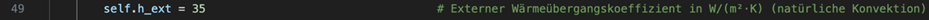
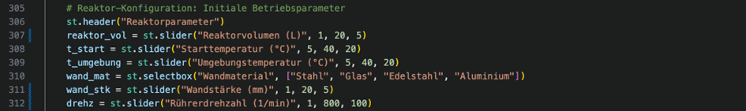
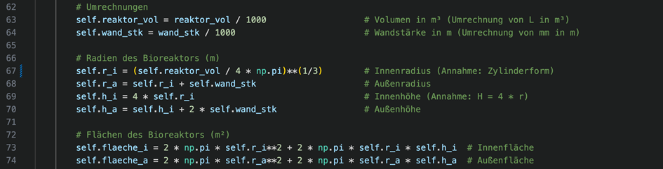
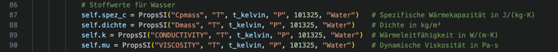
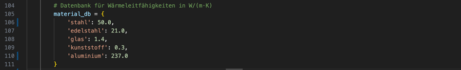
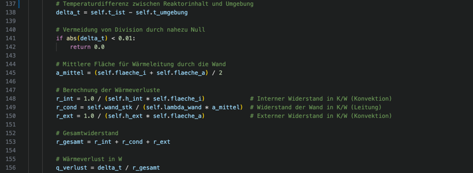
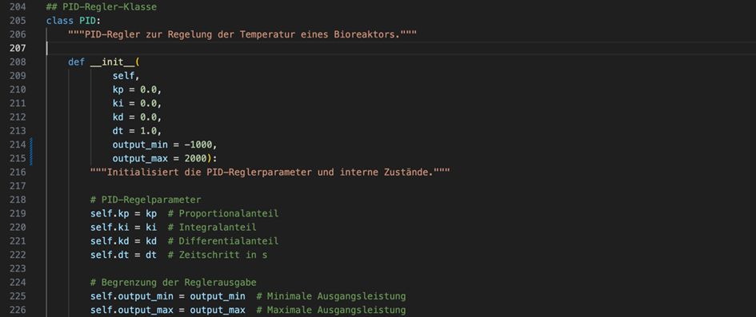
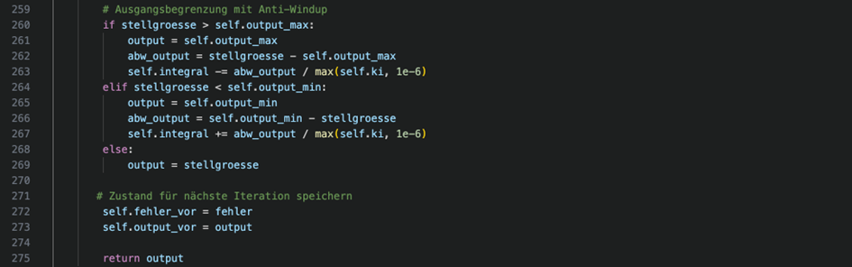

# Projekt 9: Simulation einer Temperaturregelung von Bioreaktoren


Ersteller/ -in: Jonas Jahrstorfer, Johanna Niklas

**Abgabedatum**: 13.06.2025

## Inhaltsverzeichnis

- [1. Ziel des Programms](#ziel-des-programms)
- [2. Funktionsweise der Anwendung](#2-funktionsweise-der-Anwendung)
- [3. Installation und Systemvoraussetzungen](#3-installation-und-systemvoraussetzungen)
- [4. Start der Anwendung ](#4-start-der-anwendung)
- [5. Bedienungsanleitung](#5-bedienungsanleitung)
- [6. Tabs der Benutzeroberfläche](#6-tabs-der-benutzeroberfläche)
- [7. Modellschwächen und Limitationen](#7-modellschwächen-und-limitationen)
- [8. Fazit](#8-fazit)
- [9. Wissenschaftliche Quellen](#9-wissenschaftliche-quellen)
- [10. Nutzung von Sprachmodellen](#10-nutzung-von-sprachmodellen)


## 1. Ziel des Programms
In diesem Projekt wird ein Bioreaktor-Modell mit einer simulierten Temperaturregelung umgesetzt. Ziel ist es, das thermische Verhalten eines Bioreaktors unter verschiedenen Betriebsbedingungen zu analysieren und durch eine PID-Regelung stabil auf eine gewünschte Solltemperatur zu bringen. Die Benutzeroberfläche wird mit Streamlit realisiert, wodurch eine interaktive Anpassung aller relevanten Parameter in Echtzeit möglich ist.

## 2. Funktionsweise der Anwendung
Die Anwendung kombiniert thermophysikalische Berechnungen mit einer Regelstrecke. Der Nutzer kann Parameter wie Reaktorgröße, Materialeigenschaften, Regelparameter und Umgebungstemperaturen anpassen. Der Temperaturverlauf des Reaktorinhalts wird daraufhin berechnet und grafisch dargestellt - mit und ohne aktive Regelung.

### PID - Regelung
Ein PID - Regler besteht aus drei Komponenten:

- **Proportional (P)**: Reagiert auf den aktuellen Unterschied zur Solltemperatur.

- **Integral (I)**: Reagiert auf die Summe aller vergangenen Abweichungen.

- **Differential (D)**: Reagiert auf die Änderungsgeschwindigkeit der Abweichung.

Diese Regelung erlaubt eine präzise Steuerung der Heizleistung, sodass Schwankungen schnell ausgeglichen werden und eine stabile Zieltemperatur erreicht wird.

## 3. Installation und Systemvoraussetzungen
Um den Code auszuführen sind zwei Vorraussetzungen notwendig:

- Python 3.9 oder höher
- Internetverbidung (für evtl. Nachinstallationen von Bibliotheken)

### Notwendige Bibliotheken:
Das Programm verwendet folgende externe Bibliotheken:
- ``` streamlit``` - UI-Komponenten für Web - App.
- ```matplotlib``` - Diagramme und Visualisieriung.
- ```CoolProp``` - Zugriff auf thermophysikalische Stoffdaten.
- ``` fluids``` - Prandtl-Zahl-Berechnung für Wärmeübertragung.

Die Installation erfolgt via: 
```bash 
pip install streamlit matplotlib CoolProp fluids
```

## 4. Start der Anwendung

1. Öffne das Terminal (z.B. in VS Code) oder die Eingabeaufforderung
2. Navigiere in den Ordner, in dem sich die Datei ... befindet
3. Starte das Programm mit dem Befehl:
```bash
streamlit run Projekt_9.py
```
4. Die Benutzeroberfläche öffnet sich im Standardbrowser.

## 5. Bedienungsanleitung
### Parametersteuerung
Alle Einstellungen werden über die linke Seitenleiste vorgenommen:

#### **Physikalische Parameter**
| Parameter                  | Funktion                                             |
| -------------------------- | ---------------------------------------------------- |
| **Reaktorvolumen (L)**            | Flüssigkeitsmenge im Reaktor.                        |
| **Starttemperatur (C°)**          | Starttemperatur der Flüssigkeit. |
| **Umgebungstemperatur**    | Temperatur der Luft um den Reaktor.                   |
| **Wandmaterial** | Unterschiedliche Wäremleitfähigkeit (z.B. Edelstahl, Glas). Beeinflusst Wärmeleitfähigkeit und -speicherung.
   **Wandstärke (mm)**	|Bestimmt den Wärmewiderstand der Reaktorwand.  |
|**Rührerdrehzahl (1/min)** | Beeinflusst die Durchmischung und den Wärmeübergang im Reaktor. Höhere Drehzahlen fördern eine gleichmäßige Temperaturverteilung.

#### **Sollwert und Simulation**
| Parameter                  | Funktion                                             |
| -------------------------- | ---------------------------------------------------- |
| **Solltemperatur (°C)**    | Zieltemperatur, auf die geregelt werden soll.        |
| **Simulationsdauer**       | Dauer der Simulation in Minuten.                     |
|**Zeitschritte (s)**| Gibt an, in wie viele Abschnitte die Simulationszeit unterteilt wird. Höhere Werte führen zu genaueren, aber rechenintensiveren Ergebnissen.

#### **PID - Parameter**
 
| Parameter                  | Funktion                                             |
| -------------------------- | ---------------------------------------------------- |                                                                             
| **Kp (Proportional)** | Reagiert direkt auf die aktuelle Abweichung vom Sollwert. Je größer die Abweichung, desto stärker die Korrektur. |
| **Ki (Integral)**     | Summiert alle vergangenen Abweichungen. Verhindert bleibende Fehler (Offset), wirkt aber langsam.                |
| **Kd (Differential)** | Reagiert auf die Änderungsrate der Abweichung. Bremst schnelle Änderungen ab und reduziert Überschwingen.        |


## 6. Tabs der Benutzeroberfläche

**Simulation**:

- Zeigt Temperaturverläufe mit und ohne Regelung. 
- Reagiert sofort auf Änderungen der Parameter.

**Analyse**:
 - Liefert Kennzahlen zur Regelgüte, etwa Einschwingzeit, Regelabweichung oder Energiebedarf.
 - Ermöglicht eine Bewertung der gewählten PID Einstellungen.


## 7. Modellschwächen und Limitationen

Trotz der realitätsnahen Simulation besitzt das Modell einige vereinfachende Annahmen und Einschränkungen, die bei der Interpretation berücksichtigt werden sollten:

**Homogene Temperaturverteilung**:

- Das Modell geht davon aus, dass die Temperatur im Reaktorinneren stets homogen ist.
- In der Realität können Temperaturgradienten auftreten – insbesondere bei großen Volumina oder unzureichender Rührintensität.

**Konstante Umgebungsbedingungen**:

- Es wird mit einer konstanten Umgebungstemperatur gerechnet.
- Einbauten (wie Sensoren, Heizelemente, Schläuche) oder realistische Rührergeometrien werden nicht abgebildet.

**Medium = Wasser**:

- Es wird ausschließlich Wasser mit temperaturabhängigen Eigenschaften simuliert.
- Biologische Medien (z. B. Nährlösungen, Zellkulturen) haben andere thermische Eigenschaften, Viskositäten und Verhaltensweisen.

## 8. Fazit
Die Anwendung zeigt auf verständliche und vereinfachte Weise, wie eine Temperaturregelung funktioniert, welche physikalischen Größen relevant sind und wie sich unterschiedliche Regler-Einstellungen auf das Verhalten des Systems auswirken. Sie eignet sich als Grundlage für weiterführende Projekte in Biotechnologie oder Verfahrenstechnik.

## 9. Wissenschaftliche Quellen
Die im Projekt verwendeten Formeln, Stoffdaten und Regelalgorithmen wurden den genannten Quellen entnommen oder daran angelehnt und an den jeweiligen Stellen im Code umgesetzt.

**Bioreaktormodellierung und Stoffwerte:**

- [Stoffwertdatenbank – Wärmeübertragung](https://www.schweizer-fn.de/stoff/wuebergang_gase/wuebergang_gase.php)  

- [Sartorius Biostat B DCU Datenblatt](https://www.sartorius.com/download/12082/broch-biostat-b-dcu-sbi1555-d-data.pdf)  


- [Thermo Fisher: Applikationshinweis](https://assets.thermofisher.com/TFS-Assets/LED/Application-Notes/D00154~.pdf) 
 

- [Formelsammlung angewandte Mathematik, Universität Wien](https://mmf.univie.ac.at/fileadmin/user_upload/p_mathematikmachtfreunde/Materialien/Formelsammlung-Angewandte_Mathematik.pdf)  
- [IKA HABITAT cell – Technische Daten](https://www.ika.com/de/Produkte-LabEq/Bioreaktoren-pg233/HABITAT-cell-sw-2-einwandig,-fuer-2-l-10007648/Technische-Daten-cptd.html) 

 
- [Grundlagen der Rührtechnik – Thaletec](https://thaletec.com/news/uebersicht-newsletter/newsletter-106/grundlagen-der-ruehrtechnik)  

- Ignatowitz, E. (2015). *Chemietechnik* (12. Aufl.). Europa-Lehrmittel  

- [CoolProp Dokumentation](http://www.coolprop.org/coolprop/HighLevelAPI.html#propssi-function)  
- [VDI-Wärmeatlas – Stoffdaten Wasser (2006)](https://www.ltt.uni-rostock.de/storages/uni-rostock/Alle_MSF/ITU/Downloads/Laborpraktikum/Kanalstroemung/VDI_Waermeatlas_2006_Stoffdaten_Wasser.pdf)  

- [Dynamische Viskosität – Flottweg Wiki](https://www.flottweg.com/de/wiki/trenntechnik/dynamische-viskositaet/)  

- [Wärmeleitfähigkeit – Baunetzwissen](https://www.baunetzwissen.de/glossar/w/waermeleitfaehigkeit-664148)  

- [Thermal Conductivity – Steelprogroup](https://steelprogroup.com/de/stainless-steel/properties/thermal-conductivity/) 
- [Reynoldszahl – Tec-Science](https://www.tec-science.com/de/mechanik/gase-und-fluessigkeiten/reynolds-zahl-laminare-und-turbulente-stromung/) 

- [Prandtl-Zahl – Python-Bibliothek fluids](https://fluids.readthedocs.io/fluids.core.html#fluids.core.Prandtl)  

- Stephan, P. et al. (2019). *VDI-Wärmeatlas* (12. Aufl.). Springer Vieweg
  

- [Dittus-Boelter-Korrelation – ScienceDirect](https://www.sciencedirect.com/topics/engineering/dittus-boelter-correlation)  

- [Übungslösungen Wärmeübergang – KIT](https://www.tft.kit.edu/geschuetzte_dokumente/wueI_uebung_10_loesung.pdf)  

- Werner, F. *Skript Physik 2*, Hochschule Weihenstephan-Triesdorf  

- [Python PID-Regler – itzwieseltal.wordpress.com](https://itzwieseltal.wordpress.com/2020/06/02/python-pid-regler/)  

[Manuelle Bestimmung von PID-Parametern (PDF, belektronig.de)](https://belektronig.de/wp-content/uploads/2023/03/Manuelle-Bestimmung-von-PID-Parametern.pdf)  


**Weitere Literaturquellen:**

- Stephan, P., & Stephan, K. (2021). *Thermodynamik: Grundlagen und technische Anwendungen*. Springer Vieweg  
- Bejan, A. (2013). *Convection Heat Transfer*. Wiley  
- Kuo, B. C., & Golnaraghi, F. (2017). *Automatic Control Systems*. McGraw-Hill  
- Åström, K. J., & Hägglund, T. (2006). *PID Controllers: Theory, Design, and Tuning*. ISA  
- Schmidell, W., Bischof, F., & Deckwer, W.-D. (2019). *Bioreaktoren und periphere Systeme*. Springer Vieweg  
- Doran, P. M. (2012). *Bioprocess Engineering Principles*. Academic Press  
- Vogel, H. C., & Todaro, C. L. (2020). *Fermentation and Biochemical Engineering Handbook*. William Andrew Publishing  


## 10. Nutzung von Sprachmodellen

Für Unterstützung bei der Codeentwicklung, Dokumentation und Fehlersuche wurden Sprachmodelle wie ChatGPT, Claude.ai und GitHub Copilot verwendet.


**ChatGPT-Prompts:**
- „Ich möchte einen PID-Regler in mein Python-Programm integrieren. Bitte gib mir eine saubere, gut verständliche Beispielimplementierung.“
- „Hier mein bisheriger Code. Im Internet habe ich eine Anleitung zur Implementierung eines PID-Reglers gefunden. Könntest du diese auf mein Programm anwenden?“
- „Was sind reale PID-Parameter für einen Bioreaktor-Prozess?“
- „Wie viel Heiz- und Kühlleistung sind für einen 20 l Bioreaktor realistisch?“  
- „Was sind reale PID-Parameter für einen Bioreaktor-Prozess?“  
- „Ist mein Code PEP-8-konform?“  

**Claude.ai-Prompts:**

- „Schreibe mir ein Python-Programm, zur Simulation von Temperaturschwankungen in einem Bioreaktor. Implementieren einen PID-Regler, um die Temperatur auf der Grundlage von Abweichungen von einem Zielwert anzupassen. Visualisieren die Leistung des Systems und dokumentieren, wie sich Änderungen der Parameter des Reglers auf die Stabilität des Systems auswirken.“
- „Könntest du bitte eine Klasse für einen PID-Regler in Python erstellen?“
- „Verwende Streamlit als Benutzeroberfläche mit einer Sidebar zur Einstellung relevanter Parameter.“
- „Verbessere die PID-Regler-Klasse mit einer Anti-Windup-Funktion.“  
- „Verwende Streamlit als Benutzeroberfläche mit Sidebar zur Einstellung relevanter Parameter.“  

**GitHub Copilot-Prompts:**

- „Schreibe ein Python-Programm mit Streamlit zur Simulation der Temperaturregelung in einem Bioreaktor...“  
- „Kann man die Bioreaktor-Geometrie in eine eigene Funktion packen?“  
- „Wie kann ich ein Logo im oberen Bereich einer Streamlit-App einfügen?“  
- „Muss ich den Zustand des Bioreaktors und des PID-Reglers bei jedem neuen Simulationslauf zurücksetzen, oder kann ich die Objekte weiterverwenden?“
- „Kann man die Bioreaktor-Geometrie in eine eigene Funktion packen?“
- „Wie kann ich ein Logo im oberen Bereich einer Streamlit-App einfügen?“
- „Ist mein Code PEP-8-konform? Enthält er Rechtschreib-, Programmier- oder Logikfehler? Bitte überprüfe ihn entsprechend.“


            